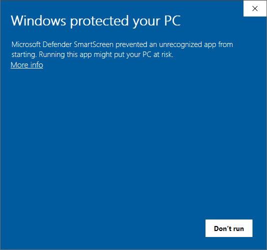
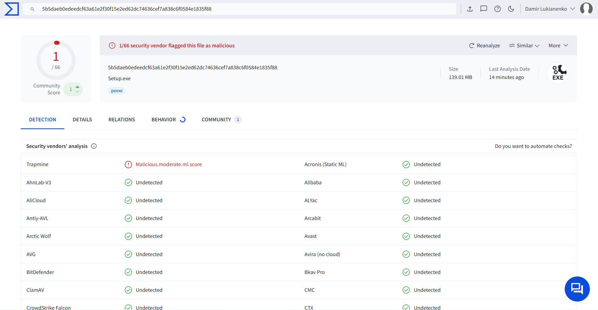

# CodeLevels Desktop App

CodeLevels is a desktop app built with Electron that provides a native experience for browsing and using CodeLevels projects. 

It allows users to access the CodeLevels.net website directly from their desktop without needing a web browser.

- Website: https://codelevels.net/projects/
- GitHub Releases: https://github.com/Ca-tt/codelevels-app/releases

## How to use the Releases page

1. Open the GitHub Releases page: https://github.com/Ca-tt/codelevels-app/releases
2. Select the latest release.
3. Download the installer or package for your operating system:
   - Windows: `.exe`
   - macOS: `.dmg` or `.zip`
   - Linux: `.AppImage`, `.deb`, or `.rpm`
4. Open the downloaded file and follow the installation steps.
5. Launch the app after installation.

If your operating system warns about an unknown app, allow it to run and continue the installation.

## Features

- Opens CodeLevels in a desktop window
- Includes handy shortcuts like `ALT+left arrow` and `ALT+right arrow` for navigation
- Automatic update checks are enabled by default!

## Microsoft Defender SmartScreen warning

When installing the app on Windows, you may encounter a Microsoft Defender SmartScreen warning:

This project is open-source and the installer is not signed with a trusted code‑signing certificate. Obtaining a trusted certificate involves costs, so SmartScreen may flag the installer.

Before installing, verify the release on GitHub and inspect the source if you wish. You can also verify the installer integrity by comparing the SHA256 checksum published on the GitHub release with the checksum of the downloaded file.

If you prefer, build the app from source following the repository instructions instead of using a prebuilt installer.

## VirusTotal scan results

VirusTotal may also flag the app. We scanned the released app — the report showed just one tiny warning from a single antivirus engine, which is likely a false positive:

